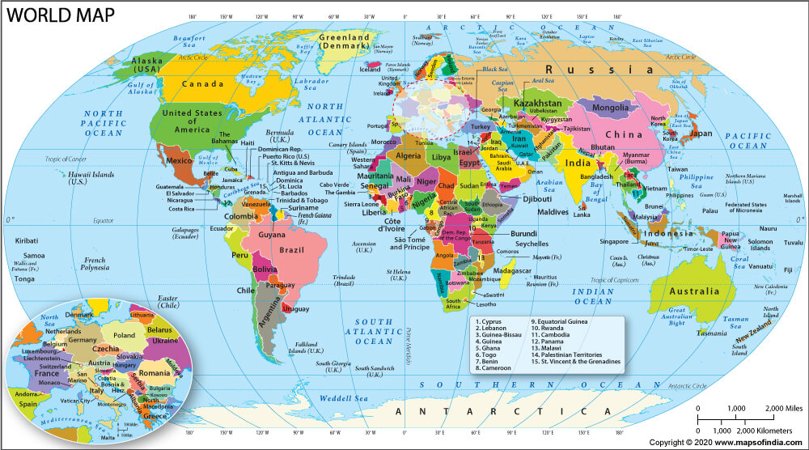
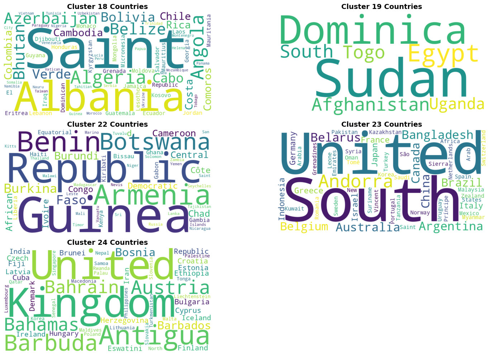

# 🌍 Can Machine Learning Classify Countries Better Than the Human Development Index (HDI)?  

---

## 🧠 Overview  
The classification of countries into their respective economics has been very controversial. The most acceptable classification is the Human Development Index (HDI). However, HDI only considers three factors which is not enough to determine the appropriate classification of countries into their respective economics. 
This project applies **Self-Organizing Maps (SOM)** — an **unsupervised neural network algorithm** — to classify **195 countries** based on **32 socio-economic attributes**.  
<p>Unlike traditional approaches such as the <b>Human Development Index (HDI)</b> that depend on just a few indicators, this project introduces a <b></b>multi-dimensional, data-driven method</b> that offers a <b>more objective and fair classification</b> of global development levels.</p>  
<p></p>
<p><i>Source: <a href="https://www.mapsofindia.com/world-map/" target="_blank">https://www.mapsofindia.com/world-map/</a></i></p>


> **Goal:** To build a robust machine learning framework that classifies countries into economic categories without human bias, using 32 quantitative indicators.

---

## 🎯 Motivation  
Organizations like the **World Bank**, **United Nations**, and **Wikipedia** classify nations into *developed*, *developing*, or *underdeveloped* categories using very few metrics — often **1 to 3 criteria** such as GDP per capita, literacy rate, or life expectancy.  

This approach, while simple, **fails to capture the complexity** of modern development.  
By leveraging **machine learning**, this project provides a **comprehensive, unbiased, and data-centric classification** model that reflects the true global diversity in economic and social progress.

---

## ⚙️ Methodology  

### 1️⃣ Data Collection & Preprocessing  
- Gathered data for 195 countries from **reliable global sources** (World Bank, UNDP, IMF, Wikipedia).  
- Selected **32 features** across domains like economy, education, infrastructure, and governance.  
- Cleaned and normalized data using `Pandas` and `Scikit-learn`.  

### 2️⃣ Algorithm: Self-Organizing Map (SOM)  
- SOM is an **unsupervised learning** technique that reduces **high-dimensional data** into a **2D representation**.  
- The model learns to cluster similar countries together based on feature similarity.  
- The SOM grid output displays meaningful **clusters** that can be visually interpreted.  

### 3️⃣ Implementation Tools  
| Tool | Purpose |
|------|----------|
| Python | Core language |
| NumPy, Pandas | Data processing |
| MiniSom | SOM algorithm implementation |
| Matplotlib, Seaborn | Data visualization |
| Scikit-learn | Scaling and preprocessing |
| Jupyter Notebook | Model experimentation |

---

## 📊 Key Results  

The SOM classified **195 countries** into **5 major development categories** based on the 32 features.  

| Cluster | Development Category | Example Countries |
|----------|----------------------|------------------|
| Cluster 1 | Highly Developed | Switzerland, Japan, Germany |
| Cluster 2 | Developed | Poland, Chile, UAE |
| Cluster 3 | Developing | Brazil, China, South Africa |
| Cluster 4 | Underdeveloped | Nigeria, Pakistan, Kenya |
| Cluster 5 | Low Income / Fragile | Haiti, Yemen, Afghanistan |

> 📌 These results suggest that the SOM algorithm captures subtle variations that traditional indices often overlook.  

---

## 🧩 Visualizations  

<p align="center">
  
</p>

<p align="center">
  
</p>

- **SOM Grid:** Visual 2D representation of countries based on 32 attributes.  
- **Cluster Heatmap:** Shows which features dominate in each development cluster.  
- **Radar Charts:** Provide multi-feature comparison among countries.  

---

## 💡 Insights  

- SOM reveals **nonlinear relationships** among indicators — beyond what GDP or HDI can show.  
- Countries with similar GDP may fall into **different clusters** due to disparities in education, healthcare, or technology access.  
- Provides a **neutral, data-based framework** for policy-making, education, and economic analysis.  

---

## ⚙️ How to Run  

```bash
# Clone the repository
git clone https://github.com/yourusername/Applying-the-SOM-in-the-Classification-of-195-Countries.git

# Navigate to the folder
cd Applying-the-SOM-in-the-Classification-of-195-Countries

# Install dependencies
pip install -r requirements.txt

# Run the notebooks
jupyter notebook notebooks/04_self_organizing_map_training.ipynb
