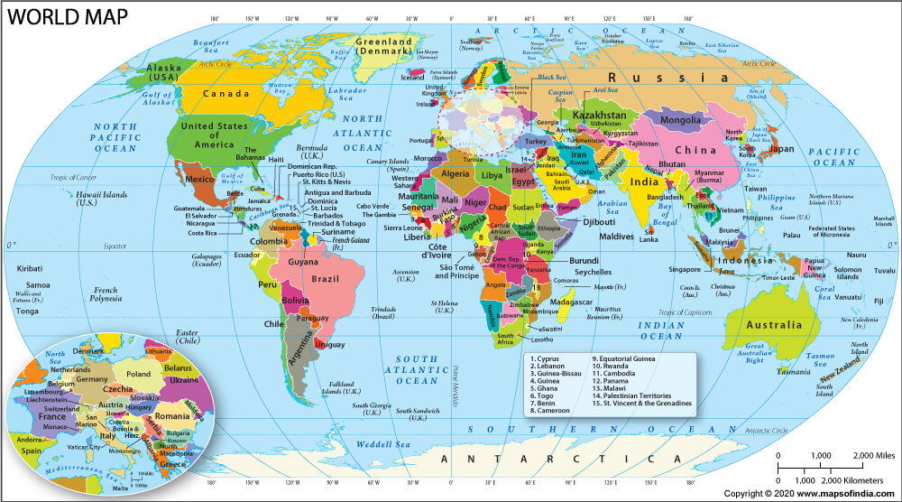

# Applying-the-Self-Organizing-Map-in-the-Classification-of-195-Countries-Using-32-Attributes

Conducted a research project to classify countries using machine learning, addressing biases inherent in traditional methods like the Human Development Index. Developed an objective tool to accurately categorize countries into economic classes, ensuring fair and unbiased classification based on comprehensive economic indicators.

<i>Source: https://www.mapsofindia.com/world-map/</i>

Many organizations such as World Bank, UN, Wikipedia and others have tried to classify countries as under-developed, developing, developed and highly developed countries based on certain criteria but these criteria aren’t robust enough. In most cases, they used one to three criteria. This research classified 195 countries using 32 attributes (features/ criteria) with the self-organizing map (SOM) algorithm. This is a robust classification because 32 features are considered for the classification.

  
  
SOM is an unsupervised learning algorithm which reduces high dimensional data to 2 dimensions. The SOM classifies the 195 countries into 5 categories, implying that it is possible to classify countries with SOM algorithm. There is no benchmark to measure the accuracy of the SOM algorithm because most classifications are based on at most three criteria which are not robust enough, but comparing the results of the SOM algorithm with these weak classifications still show the flawlessness of the SOM algorithm. This research will help scientist, students, lecturers, teachers, organizations and countries to have a robust knowledge about the state of their countries from an unbiased position and will also help organizations and countries to make concrete decisions about business establishment in viable places all over the world. The key limitation is the reliability of the data and the number of attributes, which could be increased in future researches for better results.

<b>Adebayo Rotimi Philip (2023)</b>. Applying the Self-Organizing Map in the Classification of 195 Countries Using 32 Attributes, <i>International Journal of Intelligent Information Systems</i>, Volume 12, Issue 1, February 2023, pp. 10-25, doi: 10.11648/j.ijiis.20231201.12

